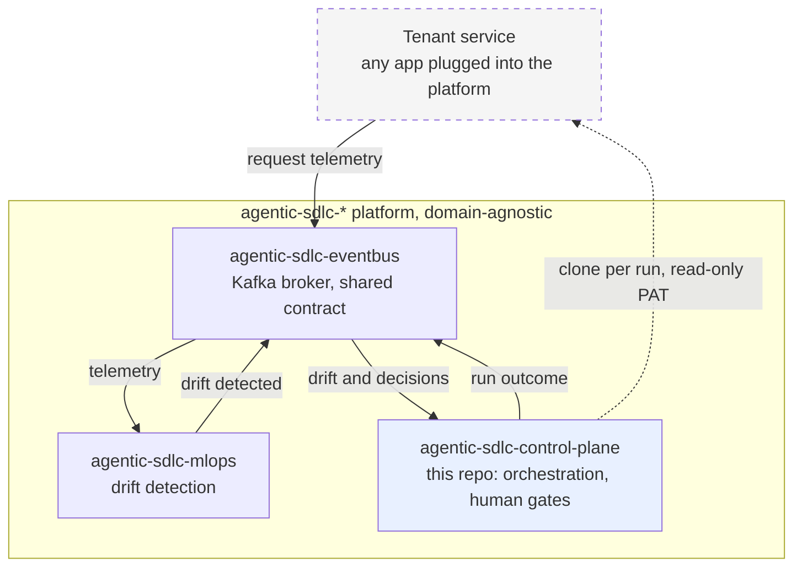
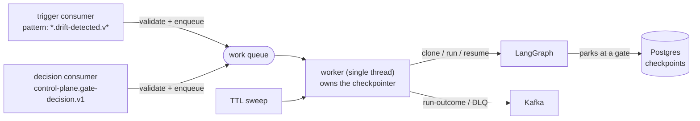
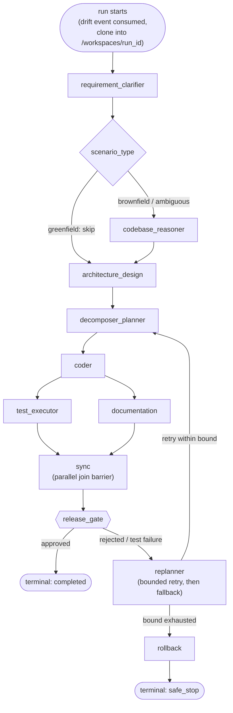

# agentic-sdlc-control-plane

LangGraph-based orchestrator for the `agentic-sdlc-*` platform. It consumes drift signals, clones
the repository of whichever service triggered the run, drives a governed multi-step
build/test/document workflow against that clone, and pauses at real human-in-the-loop gates before
continuing.

> **Designing or reviewing rather than running?** Start with
> [`docs/executive-summary.md`](docs/executive-summary.md) for a two-page orientation to the whole
> platform, then [`docs/system-design.md`](docs/system-design.md) for the authoritative design.
> This README covers how to run and use this service specifically.

> **Want to watch a complete governed run?** [Running the whole platform](#running-the-whole-platform)
> gives an OS-neutral command sequence that drives a drift signal through a clone, two human gates,
> a real pytest execution and a commit, to a `completed` outcome — in about 90 seconds, with no
> PowerShell and no credentials. The recorded result is in
> [Functional verification](#functional-verification).

## Tech stack

- **Orchestration**: Python 3.12, LangGraph 1.2.9
- **State/validation**: Pydantic 2.10.4 (pinned by the shared `agentic-events` contract, not chosen
  independently)
- **Checkpointing**: langgraph-checkpoint-postgres 3.0.5 against its own `postgres:16-alpine`
- **Events**: kafka-python-ng 2.2.3, `agentic-events` (shared envelope contract)
- **Testing**: pytest 8.3.4, pytest-cov 7.1.0

## Architecture



A tenant is any application plugged into the platform; nothing here depends on what one does — see
[`docs/adr/0001`](docs/adr/0001-keep-the-control-plane-domain-agnostic.md). Every solid arrow is a
Kafka topic; the dashed one is the only non-Kafka interaction, a read-only clone.

### Internal structure

Two Kafka consumers and one worker. Neither consumer ever executes a run:



A gate can park a run for as long as a human takes to answer, so a poll loop must never wait on
one — it would exceed `max.poll.interval.ms` and trigger a rebalance that takes every other
in-flight run on the partition with it. The poll loops therefore only validate and enqueue; the
worker executes. Parked state lives entirely in Postgres, so a run can be resumed by a different
process from the one that started it. See `docs/adr/0005`.

### The graph



Nine nodes plus two helpers (`sync`, `rollback`). Greenfield runs skip `codebase_reasoner`;
`test_executor` and `documentation` fan out in parallel and rejoin at `sync`.

### Gates

Five gate types exist in `GateType`, and which of them fire depends on `scenario_type`:
`clarification_approval` and `plan_approval` on greenfield, `codebase_impact_review` on brownfield,
`replanning_approval` when a re-planning conflict is detected, and `merge_release_approval` always.
Every gate that fires blocks, using a real LangGraph `interrupt()` backed by this repo's Postgres
checkpointer. A parked run resumes when a decision arrives on
`control-plane.gate-decision.v1`, correlated by `thread_id == run_id`.

Every run ends in exactly one reported terminal state — `completed`, `failed`, `safe_stop`,
`clone_failed`, or `stale` — published to `control-plane.run-outcome.v1`.

## Quickstart

Requires a running `agentic-sdlc-eventbus` broker.

```bash
cp secrets/postgres_password.txt.example secrets/postgres_password.txt
```

```bash
cp secrets/github_pat.txt.example secrets/github_pat.txt
```

Edit both: a password of your choosing, and a fine-grained read-only GitHub PAT with access to the
repositories this service will clone. The PAT is a runtime credential only — it is what
clone-per-run authenticates with. Nothing at build time needs it. Then:

```bash
docker compose up -d --build
```

```bash
docker logs -f agentic-sdlc-control-plane-consumer
```

Expect `Subscribed to pattern .*\.drift-detected\.v[0-9]+`. A newly created drift topic is
discovered within about 30 seconds, governed by `metadata.max.age.ms`.

### Running the whole platform

This service does something observable only when the rest of the platform is producing events.
[`scripts/demo-platform.ps1`](scripts/demo-platform.ps1) brings all four repositories up in
dependency order, waiting on a real readiness signal between stages rather than a fixed sleep —
container health where a healthcheck exists, a specific log line for the two consumer services
that have none.

It requires all four repositories checked out side by side. That is a prerequisite of the script
only: each repository still starts on its own, and no compose file references another.

```powershell
.\scripts\demo-platform.ps1 -Build
```

Drop `-Build` on subsequent runs. Add `-Demo` to drive one signal all the way through — real
traffic to the tenant service, a drift signal, a clone, a human gate, a decision, and the outcome
event read back off the broker:

```powershell
.\scripts\demo-platform.ps1 -Demo
```

`-Status` prints the state and health of every platform container; `-Down` stops everything.

Only the drift signal is injected. Genuine detection compares a trailing 7-day reference window
against the current hour, which no demo can populate. Everything after that point is the
production path: real pattern subscription, real clone, real `interrupt()`, real resume from
Postgres. The demo also mounts a synthetic fixture so the run reaches `completed` instead of
safe-stopping at the coder node — see [`docs/adr/0001`](docs/adr/0001-keep-the-control-plane-domain-agnostic.md)
for why the shipped image has none.

A cold start to `completed` takes roughly 90 seconds.

#### Driving a run without the script

The script above is a Windows convenience wrapper, not the only way in. Two repositories and four
commands are enough to see the whole governed path, on any OS with Docker. No credential is
required: the repository the run clones is public.

```bash
# 1. Broker, from the agentic-sdlc-eventbus checkout
docker compose up -d

# 2. Control plane, from this checkout, with the demo fixture mounted read-only
docker compose -f docker-compose.yml -f scripts/demo/compose.demo-fixtures.yml up -d
```

```bash
# 3. Trigger a run. RUN_ID must be unique per run - it becomes the LangGraph thread_id
#    that the gate decision below correlates on.
RUN_ID="demo-$(date +%s)"
REPO="https://github.com/jayakumard10/agentic-sdlc-eventbus.git"
kafka () { docker run --rm -i --network eventbus apache/kafka:4.1.2 "$@"; }

# event_id is a strict UUID on the envelope. Generated inside the consumer container
# rather than on the host, because no single host command covers Linux, macOS and Git
# Bash for Windows - `uuidgen` and /proc/sys/kernel/random/uuid are each missing on at
# least one of them. The container is already running by step 2.
uuid () { docker exec agentic-sdlc-control-plane-consumer python -c "import uuid;print(uuid.uuid4())"; }

envelope () {  # $1 = event_type, $2 = service, $3 = payload JSON
  printf '{"schema_version":"1.0","event_id":"%s","correlation_id":"%s","tenant":"default","service":"%s","event_type":"%s","timestamp":"%s","producer":{"service":"%s","instance_id":"manual"},"git_target":{"repo_url":"%s","branch":"main","commit_sha":null},"scenario_type":"brownfield","metrics":{},"payload":%s}\n' \
    "$(uuid)" "$RUN_ID" "$2" "$1" "$(date -u +%Y-%m-%dT%H:%M:%SZ)" "$2" "$REPO" "$3"
}

envelope drift-detected agentic-sdlc-mlops '{"sample_size":483}' \
  | kafka /opt/kafka/bin/kafka-console-producer.sh --bootstrap-server broker:19092 \
      --topic mlops.drift-detected.v1
```

The run clones the target, then parks at the first gate. Watch it with
`docker logs -f agentic-sdlc-control-plane-consumer`.

```bash
# 4. Answer each gate. A brownfield run fires two - codebase_impact_review, then
#    merge_release_approval - so send this twice, waiting for the park in between.
envelope gate-decision agentic-sdlc-control-plane \
  '{"gate_type":"any","decision":"approve","decided_by":"a-reviewer","comment":"Approved."}' \
  | kafka /opt/kafka/bin/kafka-console-producer.sh --bootstrap-server broker:19092 \
      --topic control-plane.gate-decision.v1
```

Read the outcome back off the broker, and check the audit trail is intact:

```bash
kafka /opt/kafka/bin/kafka-console-consumer.sh --bootstrap-server broker:19092 \
  --topic control-plane.run-outcome.v1 --from-beginning --max-messages 200 --timeout-ms 20000

docker exec agentic-sdlc-control-plane-consumer python -c \
  "from pathlib import Path; from agentic_control_plane.telemetry import verify_chain; \
   print(verify_chain(Path('/var/audit/runs.jsonl')))"
```

Verified on both Linux and Git Bash for Windows. One portability note, and it applies only to
**Git Bash for Windows**: export `MSYS_NO_PATHCONV=1` first, or `/opt/kafka/...` is rewritten into
a Windows path before it ever reaches the container, and the producer fails with
`exec: ... not found`. On Linux and macOS nothing extra is needed.

The `uuid` helper exists for the same class of reason. `event_id` is a strict `UUID` on the
envelope, and an empty or malformed one fails validation — the event is routed to the DLQ and the
parked run simply never resumes, which looks like a hang rather than a rejection.

## Local development

```bash
python -m venv .venv && .venv/bin/pip install -r requirements.txt
```

Run against the compose Postgres with the broker reachable on the host:

```bash
POSTGRES_HOST=localhost POSTGRES_PORT=5433 KAFKA_BOOTSTRAP_SERVERS=localhost:9092 python -m agentic_control_plane.main
```

Configuration:

| Variable | Default | Purpose |
|---|---|---|
| `KAFKA_BOOTSTRAP_SERVERS` | *(required)* | Event bus. Use port 9093 from another container, 9092 from the host. |
| `POSTGRES_HOST` / `PORT` / `DB` / `USER` | `postgres` / `5432` / `control_plane` / `control_plane` | Checkpoint store |
| `POSTGRES_PASSWORD_FILE` | — | Path to the password file. `POSTGRES_PASSWORD` also works but is visible in `docker inspect`. |
| `GIT_PAT_FILE` | — | Path to the PAT used to clone target repositories |
| `WORKSPACES_ROOT` | `/workspaces` | Where per-run clones live |
| `FIXTURES_DIR` | `/fixtures` | Replay-mode fixtures. Empty unless you mount your own — see below. |
| `ORCHESTRATOR_MODE` | `replay` | `live` requires a `claude` CLI this image does not install |
| `PUBLISH_MODE` | `none` | `none` / `branch` / `pull_request`. What happens to an approved change. Anything but `none` needs a **write-scoped** PAT — see [ADR 0012](docs/adr/0012-an-approved-change-must-outlive-the-run-that-made-it.md) |
| `PARKED_RUN_TTL_HOURS` | `24` | After this, a parked run is reported `stale` and cleaned up |
| `REPLANNING_CONFLICT_MARKERS` | *(empty)* | Comma-separated module names that count as an existing-functionality conflict |
| `AUDIT_LOG_PATH` | `/var/audit/runs.jsonl` | Hash-chained audit trail of every node execution and gate decision. Verify with `verify_chain`. |

### What happens to an approved change

A completed run's commit is delivered before its workspace is reclaimed — that window is the only
point at which it still exists on disk.

| `PUBLISH_MODE` | Behaviour |
|---|---|
| `none` *(default)* | Commit and report. Governance without delivery, and the PAT stays read-only |
| `branch` | Push `agentic-patch/{run_id}`. Works against any git host |
| `pull_request` | Push, then open a request against **the branch the run cloned**. GitHub only; elsewhere the branch still lands and the reason is reported |

The push names `HEAD:refs/heads/agentic-patch/{run_id}` explicitly, so nothing here can write to the
branch the run cloned. The outcome event carries `commit_sha_after`, `published`, the branch, a
`pull_request_url` where there is one, and `publish_error` where delivery failed.

A delivery failure does not fail the run — the change was generated, tested and approved either way
— but it is reported on the outcome event, because a failed push means the change was discarded.
See [ADR 0012](docs/adr/0012-an-approved-change-must-outlive-the-run-that-made-it.md).

### Code generation modes

Neither generation mode works out of the box, by design rather than omission:

- **Replay** needs fixtures, which are recordings of work on one specific service. A domain-agnostic
  platform cannot ship them, so `FIXTURES_DIR` is an empty mount point. Mount fixtures shaped as
  `{scenario_type}/transcript.json` to enable it.
- **Live** needs the `claude` CLI on `PATH` and an authenticated session, neither of which this
  image provides. It is an opt-in built on a customised image.

Without either, a run reaches the coder node and safe-stops with a stated reason, ending in a
defined terminal state with outcome telemetry. See `docs/adr/0001`.

Live mode has been exercised for real, not just reasoned about: running the worker on a host that
has the CLI (rather than in the shipped image) drove a full brownfield run in which the coder node
invoked `claude` and generated two files in 112 s, `test_executor` ran a real pytest against them,
and the release gate committed the result — see [Functional verification](#functional-verification).
That is the same code path a customised image would take; only the location of the CLI differs.

## Testing

```bash
pytest --cov=agentic_control_plane --cov-report=term-missing
```

256 tests, 91% statement coverage. CI enforces a floor of 90% (`--cov-fail-under=90`), so coverage
can only ratchet upward — and because skipping the durability tests drops it to 88%, a CI run whose
Postgres service container never came up fails there rather than passing quietly.

The durability tests need a reachable Postgres and skip without one; run them against the compose
Postgres. Pass the same secret file Compose gives the database — the password default in
`_postgres_conn_string` is `control_plane`, which is deliberately not the password you were told to
choose in Quickstart, so omitting it authenticates as the wrong user and every one of these tests
skips rather than fails:

```bash
POSTGRES_HOST=localhost POSTGRES_PORT=5433 POSTGRES_USER=control_plane POSTGRES_DB=control_plane \
  POSTGRES_PASSWORD_FILE=secrets/postgres_password.txt \
  pytest --cov=agentic_control_plane --cov-report=term-missing
```

A run that reports skips here has not exercised durability. `256 passed` with no skips is the
whole suite; anything less means the credential did not reach Postgres.

Coverage gaps are concentrated in code that needs live infrastructure to exercise meaningfully:
real `KafkaProducer`/`KafkaConsumer` construction (`events.py`, `main.py`) and the live `claude`
CLI paths (`coder.py`). Those are covered by functional verification instead.

### Functional verification

Run end-to-end against a real broker and a real Postgres, from inside the container:

| Check | Result |
|---|---|
| Pattern subscription discovers a topic created after startup | PASS — run began ~31s after publish |
| Container consumes a drift event through the event bus's cross-container listener | PASS |
| Container publishes its outcome event through the same listener | PASS — consumed back off the topic, `producer.instance_id` matching the container hostname |
| Private-repo HTTPS clone using the mounted PAT | PASS — cloned at commit `335472aa`, against a repository that was private when this was run |
| A PAT lacking access fails cleanly | PASS — 403 became a `clone_failed` outcome, no crash |
| Run parks at a real `interrupt()` without blocking the poll loop | PASS |
| Kafka gate decision resumes the parked run | PASS |
| `test_executor` runs a real pytest subprocess against the clone | PASS — 1075ms |
| Full completion in-container | PASS — commit `9224abcd`, `completed`, workspace removed |
| Unmounted fixtures safe-stop with a stated reason | PASS |
| Workspace deleted on terminal state | PASS |
| Parked run resumed by a *different* process after the original was killed | PASS |
| Startup reconciliation removes orphaned workspaces | PASS |
| The documented script-free sequence above, run in replay mode | PASS — 2026-08-01, cloned at `820750d2`, both gates answered, real pytest passed in 1336 ms, 0 guardrail findings, commit `9637e763`, `completed` |
| The same sequence a second time, in the same process | PASS — `completed`, `run-outcome` published with the clone-time `commit_sha` |
| **`ORCHESTRATOR_MODE=live`: real generation via the `claude` CLI** | PASS — 2026-08-01, coder generated 2 file(s) in 111 875 ms, `test_executor` passed a real pytest against them in 1 609 ms, 0 guardrail findings, commit `9251028d`, `completed` |
| The same sequence run from a **Linux** shell | PASS — driven from a Linux container against the same daemon, twice, both to `completed` (commits `26c3575a`, `65d809f5`) |
| **Every run is audited, not only the first** | PASS after ADR 0011 — two consecutive runs on a fresh audit volume recorded **17 records each** on `control-plane.audit.v1`, one continuous 34-record chain. Before the fix, the second run recorded **zero** despite completing |
| **`PUBLISH_MODE=branch`: an approved change reaches the tenant repository** | PASS — 2026-08-01, in-container run pushed `agentic-patch/clean-1785628701` at `b0d47320`; the outcome event carried `commit_sha_after`, `published: true` and the branch. `main` untouched |
| The delivered branch carries the change and nothing else | PASS — after excluding build artefacts: 3 files (module, its test, the generated doc). The first delivery before that fix carried 4 `.pyc` files |
| Hash-chained audit trail | PASS — `verify_chain` clean over all 34 records, and continuous across a container restart |
| An empty `event_id` is rejected rather than acted on | PASS — envelope validation routed it to the DLQ; the parked run was untouched and resumed normally once a valid decision arrived |

The two rows about running the sequence twice are the ones worth understanding together, because
the second run is what exposed [ADR 0011](docs/adr/0011-the-audit-cursor-belongs-to-the-run-not-the-process.md).
Both runs completed and published outcomes, and `verify_chain` reported the trail intact — while
the second run was missing from it entirely. A chain proves record N follows N−1; it is evidence
about the records that are present and none at all about the ones that should be. The check that
actually catches it is counting records per `correlation_id` on the audit topic against runs
served, which is what the "every run is audited" row reports.

Memory, sampled across a full run including the pytest subprocess: **69.6 MiB against the 1 GiB
limit**, flat throughout; the Postgres container sits at 36 MiB against 512 MiB.

Five defects were found by these runs and by nothing else, with a full unit suite passing
throughout all of them. They are written up in `docs/adr/0002` through `0006`.

## Deployment / CI

`.github/workflows/ci.yml` runs on every push and pull request to `main`.

The test job runs the suite against a real `postgres:16-alpine` service container rather than
skipping the durability tests — those tests are the reason a durable checkpointer was chosen over
an in-memory one, so skipping them would leave the property that matters unverified. It also
asserts that no tenant-specific vocabulary has entered the package or its tests.

The compose job builds the image and asserts no credential persisted into it, by reading
`/root/.gitconfig`'s size. No build step writes one today, so that check passes trivially — it is
kept as a regression guard, because this is the image that handles a real PAT at runtime. It does
not run the consumer: this repo is independently clonable with no sibling checkout, so there is no
broker in CI to point it at.

Neither job needs a repository secret. `agentic-events` resolves over anonymous HTTPS from the
public `agentic-sdlc-eventbus` repo, and CI never performs a real clone.
