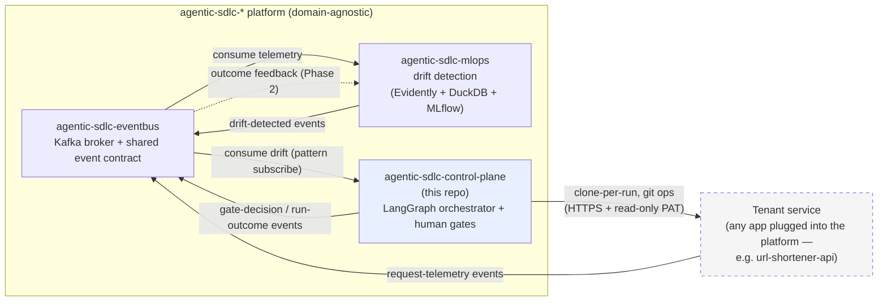
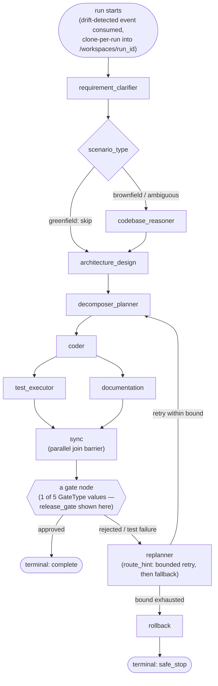

# agentic-sdlc-control-plane

LangGraph-based orchestrator for the `agentic-sdlc-*` platform: consumes drift signals, runs a
governed multi-step build/test/document workflow against a cloned copy of whichever tenant
service's repo triggered it, and pauses at real human-in-the-loop gates before continuing.

## Status: design only

No implementation yet. Per the platform's locked build order — `agentic-sdlc-eventbus` →
`url-shortener-api` → `agentic-sdlc-mlops` → `agentic-sdlc-control-plane` — this repo's actual
code follows once `agentic-sdlc-mlops` exists and can produce real drift-detected events to build
and test against. This document captures the architecture ahead of that so the design is settled
before implementation starts, not discovered mid-build.

## Tech stack (planned)

- **Orchestration**: Python 3.12, LangGraph 1.2.9
- **State/validation**: Pydantic 2.10.4
- **Checkpointing**: langgraph-checkpoint-postgres 3.0.5, own `postgres:16-alpine` (database-per-service)
- **Events**: kafka-python-ng, `agentic-events` (shared envelope contract)
- **Testing**: pytest 8.3.4

## Role in the platform

`url-shortener-api` is named only as a concrete, illustrative example of a tenant service — this
repo has no code or logic referencing it directly, and the diagram holds unchanged for any other
tenant service plugged into the same slot.

## Internal graph design

Nine LangGraph nodes (`requirement_clarifier`, `codebase_reasoner`, `architecture_design`,
`decomposer_planner`, `replanner`, `coder`, `test_executor`, `documentation`, `release_gate`) plus
two helpers (`sync`, the parallel join barrier; `rollback`). Routing is conditional:
`greenfield` runs skip `codebase_reasoner`; `test_executor` and `documentation` fan out in
parallel and rejoin at `sync`; a bounded retry → fallback → rollback → `safe_stop` governance
chain bounds how long a failing run keeps retrying before giving up cleanly.

## Gates

Five gate points exist as `Literal` values in `GateType` (`release_gate` is one; the graph places
all five at their respective nodes, not enumerated individually in this diagram). Gates use a real
LangGraph `interrupt()`, backed by this repo's own durable Postgres checkpointer — not
fixture-replay. A parked run resumes when a decision message arrives on the platform's decisions
topic, correlated by `thread_id == run_id`. The consumer that triggers a run never blocks its poll
loop waiting on a human decision — resumption is a separate, later read of the decisions topic.

## What's not decided yet

Left for the actual build, once `agentic-sdlc-mlops` exists to test against:

- `ORCHESTRATOR_MODE` (live LLM calls vs. replay) and, if live, which provider
- Which of the 5 gates truly block by default, and the parked-run TTL
- The exact idempotency-key scheme for deduplicating redelivered drift events
