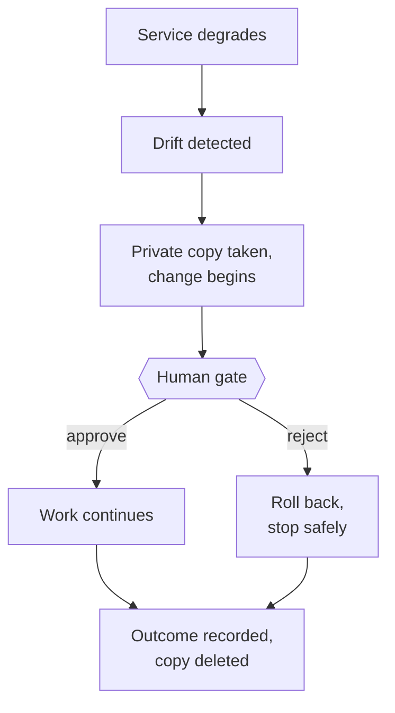

# Agentic SDLC Platform — Executive Summary

**Status:** Current · **Last verified:** 2026-07-27 · **Scope:** all four repositories

*A two-page orientation. Read section 1 for what this is; the rest adds depth in order. Deeper
material is linked at the end rather than summarised here.*

---

## 1. What this is, in one paragraph

When a running service starts to degrade — slower responses, rising error rates — someone
eventually notices, decides what to change, gets it reviewed, and ships a fix. **This platform
performs that loop automatically, while keeping a human in charge of every decision that matters.**
It watches a live service, detects when its behaviour has drifted from normal, and starts a
governed software change against that service's code: analyse, design, plan, write, test, document.
At defined points it stops and waits for a person to approve or reject, and it records every step
in an audit trail. Nothing merges without human sign-off.

The short version of why it is interesting: an AI agent writes the code, but it operates inside a
change-control process rather than instead of one.

---

## 2. The problem it addresses

AI coding agents are good at producing changes and bad at being accountable for them. In a regulated
or high-stakes environment the blocking question is not *"can the agent write the code?"* but:

| Question | How the platform answers it |
|---|---|
| Why was this change made at all? | It was triggered by a measured regression, not a prompt. The evidence is retained. |
| Who approved it? | A named human, at a defined gate, recorded in the audit trail. |
| What if the agent goes wrong? | Bounded retries, then rollback to a known commit, then a clean stop. |
| Can we prove any of this later? | Every node execution, gate decision, and outcome is recorded. |
| What if it crashes mid-change? | The change is suspended durably and resumes — on a different machine if need be. |

---

## 3. What was delivered

Four independently deployable repositories. Each clones and starts on its own, with no sibling
checkout and no shared database.

| Repository | Role | Plain English |
|---|---|---|
| `agentic-sdlc-control-plane` | Orchestration, human gates, audit | The governed workflow and its decision points |
| `agentic-sdlc-mlops` | Drift detection | Notices when the watched service degrades |
| `agentic-sdlc-eventbus` | Message broker + shared contract | How the parts talk, and the rules for what they may say |
| `url-shortener-api` | Tenant application | An ordinary app being watched — deliberately not privileged |

The first three are the **platform** and contain no knowledge of what any application they govern
actually does. The fourth is a **tenant**: a stand-in for any service that plugs in. That separation
is enforced by a build step that fails the pipeline if application-specific vocabulary leaks into
the platform — not by code review.

---

## 4. How it works

1. The tenant service reports how each request went.
2. Drift detection compares recent behaviour against a reference period and raises a signal when it
   moves beyond threshold.
3. The control plane takes a private, read-only copy of the tenant's repository, just for this run.
4. A nine-step workflow runs against that copy — clarify, analyse, design, plan, write, test,
   document, release.
5. At each governance point the run **stops and waits** for a human decision, for as long as that
   takes.
6. Every run ends in exactly one recorded outcome, and its working copy is deleted.

---

## 5. The decisions that shaped it

| Decision | Why it matters |
|---|---|
| **The four parts communicate only through messages** | Any one can be replaced, restarted, or scaled without touching the others. |
| **Human gates are real suspensions, not prompts** | A paused change survives a restart and can resume on a different machine. It is written to a database, not held in memory. |
| **The waiting is separated from the working** | A gate can wait hours. The component receiving messages never blocks, so one slow approval cannot stall everything else. |
| **One disposable copy of the code per run** | Concurrent runs cannot see or corrupt each other, and nothing is written back to the real repository. |
| **The platform knows nothing about the application** | Adding a second or tenth tenant requires no change to the platform. |
| **Credentials never enter a URL, a log, or a built image** | Verified by an automated check, not by policy. |

Full reasoning for each is in the [decision records](adr/); there are thirteen across the platform.

---

## 6. What has been proven, and how

The distinction this project draws throughout: **an automated test proves the code does what its
author expected. Running the real system proves the system works.** Both are reported, separately.

| Evidence | Result |
|---|---|
| Automated tests | **275** across four repositories; 92% statement coverage in the control plane |
| Continuous integration | Observed passing on all four repositories — a pipeline file is not treated as evidence |
| A paused change resumed by a **different process** after the original was killed | Verified |
| Cross-service message flow, in both directions, between containers | Verified |
| A credential-less clone, and a clean failure when access is denied | Verified |
| Built images carry no credential | Verified automatically on every build |

**Ten of the platform's thirteen decision records document defects found only by running the real
system**, every one of them while the automated tests were passing. That record — including why a
test could not have caught each one — is in
[`ai-engineering-practice.md`](ai-engineering-practice.md), and is the clearest available evidence
of how AI-generated mistakes were caught before they reached the final implementation.

---

## 7. What it costs to run

Measured across all seven containers running simultaneously:

| | |
|---|---|
| Total memory in use | **1.03 GiB** |
| Configured ceilings | 6.25 GiB |
| Largest single service | 318 MiB |

Comfortably inside a standard developer machine. An earlier measurement was 2.86 GiB, of which one
service accounted for 2 GiB running a feature this platform never uses; removing it cut the total
by nearly two thirds.

---

## 8. What it does not do

Stated plainly, because a summary that omits limits is marketing.

- **It does not merge to a real branch.** A run commits inside its own disposable copy. Promoting
  that change is a separate, human-initiated step.
- **There is no machine-learning model.** Drift detection compares operational measurements against
  a reference window. The component is named `mlops` for where it is going, not where it is.
- **Code generation requires operator setup.** The shipped image contains no application-specific
  material, deliberately, so an out-of-the-box run reaches the code-writing step and stops safely
  with a stated reason rather than producing something wrong.
- **It runs changes one at a time.** Correct at current volume; parallel execution is a bounded,
  planned change.
- **Single-broker messaging.** A development topology, not a resilient production cluster.

---

## 9. What comes next

| Priority | Item |
|---|---|
| Done since the last review | Durable hand-off of queued work; tamper-evident, centrally retained audit records |
| Near term | An automated end-to-end test driving detection through to recorded outcome |
| Later | A real model lifecycle — trained, versioned, monitored — replacing threshold comparison |
| Later | Parallel run execution; explicit topic provisioning; multi-tenancy |

---

## 10. Where to look next

| If you want… | Read |
|---|---|
| How the system works, in full | [`system-design.md`](system-design.md) |
| Why any particular decision was made | [`adr/`](adr/) |
| How it was built, and what caught the mistakes | [`ai-engineering-practice.md`](ai-engineering-practice.md) |
| How to run it | [`../README.md`](../README.md) |
