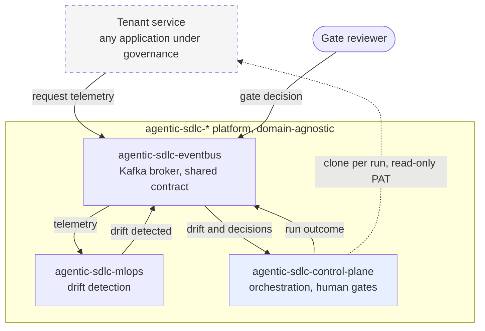
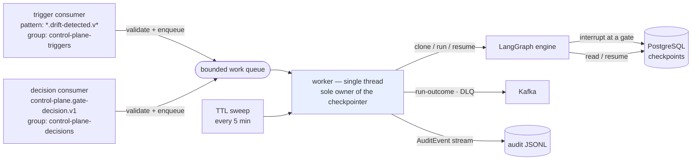
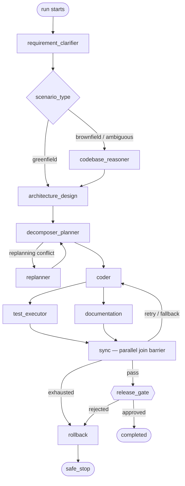
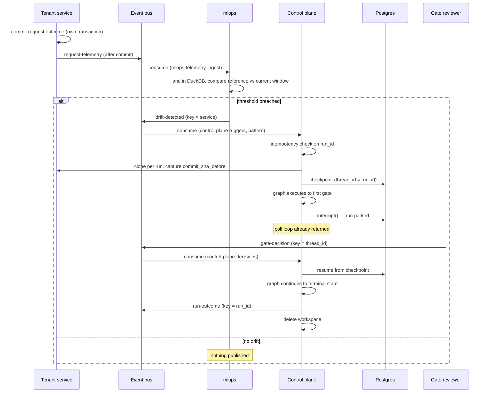

# Agentic SDLC Platform — System Design

**Status:** Current · **Last verified:** 2026-07-26 · **Owner:** Platform engineering

This is the authoritative design document for the `agentic-sdlc-*` platform. It describes the
system as built and verified, not as proposed. Content is stated as fact only where it has been
exercised against running infrastructure; anything not yet built is marked **Planned**.

Decisions and the reasoning behind them live in [`adr/`](adr/). This document describes *what the
system is*; the ADRs record *why it is that way*, and are linked from the relevant sections.

---

## 1. Purpose and scope

The platform detects operational regressions in a running service, and responds by orchestrating a
governed, human-gated software change against that service's repository.

It is built as four independently deployable repositories communicating exclusively over Kafka. No
repository shares a database, a filesystem, or a compose network with any other, and each can be
cloned and started with no sibling checkout present.

### In scope

- Operational-metrics drift detection over request telemetry
- Orchestration of a multi-step change workflow (clarify → analyse → design → plan → code → test →
  document → release) with human approval gates
- Durable suspension and resumption of a run across process restarts
- Audit of every node execution, gate decision, and run outcome

### Explicitly out of scope

- Model-based drift. Phase 1 is operational metrics only; no ML model exists in the system. See
  [§12](#12-roadmap).
- Multi-tenancy. The event contract carries a `tenant` field for forward compatibility, but the
  platform operates a single implicit tenant today.
- Automated merge to a tenant's default branch. A run commits within its own ephemeral clone; it
  does not push.

### Tenancy model

Three repositories form the **platform** and are strictly domain-agnostic — they contain no
knowledge of what any service they operate on actually does. The fourth is a **tenant**: an
ordinary application that plugs into the platform and is in no way privileged.

This separation is a hard constraint, not a convention, and is enforced by a build step rather than
by review — see [ADR 0001](adr/0001-keep-the-control-plane-domain-agnostic.md) and
[§11.3](#113-domain-agnosticism). Throughout this document a tenant service may be *named* as a
concrete example; its internals are never described, and nothing in the platform depends on them.

---

## 2. System context



Every solid arrow is a Kafka topic; the only non-Kafka interaction the platform has with a tenant
is the dashed one, a read-only clone. Both control-plane inbound flows are shown as one edge here
for legibility — they are separate topics on separate consumer groups, detailed in
[§5.1](#51-topics) and [§6.1](#61-process-structure).

| Actor | Role |
|---|---|
| Tenant service | Emits request telemetry. Its repository is the target of a run. Otherwise uninvolved. |
| Gate reviewer | A human who approves or rejects at a gate, by publishing a decision event. |
| Platform | Everything inside the boundary. Owns detection, orchestration, and audit. |

---

## 3. Design principles

These are binding constraints. Each is implemented as stated, and the verification for each is
given in [§11](#11-verification).

| # | Principle | Consequence |
|---|---|---|
| P1 | **Kafka is the only coupling.** | No shared database, filesystem, or compose network between repositories. Integration points are topics and one shared contract package. |
| P2 | **Database per service.** | The control plane owns its checkpoint store. No other component may read it. |
| P3 | **The platform is domain-agnostic.** | No platform repository may encode a tenant's concepts. Enforced by CI. |
| P4 | **Human gates are real suspensions.** | A gate is a durable interrupt backed by Postgres, not a synchronous prompt. A run survives the process that started it. |
| P5 | **A poll loop never waits on a human.** | Consumers validate and hand off. Execution happens elsewhere. |
| P6 | **A run is never lost.** | Every run terminates in exactly one reported state, including on crash or internal error. |
| P7 | **Workspaces are ephemeral and isolated.** | One clone per run, deleted on termination. Concurrent runs cannot observe each other. |
| P8 | **New producers require no code change.** | Consumers subscribe by pattern; topics auto-create. |
| P9 | **Credentials never enter a URL, a log, or an image.** | Tokens are supplied via file-mounted secrets and credential helpers, and verified absent from build artefacts. |

---

## 4. Component architecture

| Repository | Role | Stack | Package |
|---|---|---|---|
| `agentic-sdlc-control-plane` | Orchestration, human gates, audit | Python 3.12, LangGraph 1.2.9, PostgreSQL 16 | `agentic_control_plane` |
| `agentic-sdlc-mlops` | Drift detection | Python 3.12, DuckDB, Evidently, MLflow | `agentic_mlops` |
| `agentic-sdlc-eventbus` | Message broker + shared contract | Apache Kafka 4.1.2 (KRaft) | `agentic_events` |
| Tenant service | Application under governance | Any | — |

`agentic_events` is the only package installed *into* other repositories. It contains the envelope
model and validation, and deliberately no Kafka client code, so adopting the contract does not
impose a transport dependency.

### 4.1 Network topology

A listener's *advertised* address is what a client is told to reconnect to for real traffic, so it
must differ by caller position. Three listeners exist for that reason:

| Caller position | Bootstrap address | Listener |
|---|---|---|
| Container on the broker's own network | `broker:19092` | `PLAINTEXT` |
| Host machine (CLI tooling) | `localhost:9092` | `PLAINTEXT_HOST` |
| Container in a *different* compose project | `host.docker.internal:9093` | `DOCKER_INTERNAL` |

The third listener exists because reusing the second appeared to work and silently did not: it
advertises `localhost`, which inside a different container resolves to that container. Bootstrap
succeeded and every subsequent send failed. Verification for this path is therefore explicitly
container-to-container, in both directions — see [§11.2](#112-cross-repository-verification).

---

## 5. Event contract

One envelope for every message on every topic. The envelope shape is a stable contract; per-event
variation lives inside `metrics` and `payload`, which are deliberately open.

```jsonc
{
  "schema_version": "1.0",          // envelope version; bumps only on a breaking envelope change
  "event_id": "<uuid>",             // unique per message
  "correlation_id": "<string>",     // == run_id == LangGraph thread_id once a run exists
  "tenant": "default",              // forward compatibility; single tenant today
  "service": "<producer service>",  // drives the topic convention
  "event_type": "<string>",         // drift-detected | gate-decision | run-outcome | ...
  "timestamp": "<RFC 3339>",
  "producer": { "service": "<string>", "instance_id": "<hostname or container id>" },
  "git_target": { "repo_url": "<uri>", "branch": "<string>", "commit_sha": "<sha|null>" },
  "scenario_type": "greenfield | brownfield | ambiguous",
  "metrics": { },                   // event-type specific, open
  "payload": { }                    // event-type specific, open
}
```

Validation is enforced by the shared `agentic_events` Pydantic model with `extra="forbid"`, so an
unknown top-level field is rejected rather than silently ignored.

### 5.1 Topics

Convention: `{service}.{event-type}.v{n}`. No tenant segment — the system is single-tenant today,
and adding a segment later is a topic rename, not a contract change.

| Topic | Producer | Consumer group | Partition key | Ordering guarantee bought |
|---|---|---|---|---|
| `<tenant>.request-telemetry.v1` | Tenant service | `mlops-telemetry-ingest` | resource identifier | Per-resource history stays on one partition |
| `mlops.drift-detected.v1` | `agentic-sdlc-mlops` | `control-plane-triggers` | service name | A service's drift events stay mutually ordered |
| `control-plane.gate-decision.v1` | Gate reviewer | `control-plane-decisions` | `thread_id` (== `run_id`) | **Correctness-critical.** A later decision can never be processed before an earlier one for the same parked run. |
| `control-plane.run-outcome.v1` | `agentic-sdlc-control-plane` | *(open)* | `run_id` | A run's outcomes stay ordered |
| `{service}.dlq.v1` | Any | *(manual)* | source topic | — |

### 5.2 Compatibility policy

Additive-only. New fields are added as optional properties inside `payload` or `metrics`, both of
which are already open. `schema_version` bumps **only** on a breaking change to the envelope itself
— removing or renaming a required top-level field, or changing a field's type. Flexibility is
deliberately located inside the open objects rather than at the envelope level, so a consumer can
rely on the envelope's shape absolutely.

### 5.3 A note on field naming across boundaries

`decided_by` means different things on the wire (an identity) and in graph state (provenance:
whether a human or a replayed fixture resolved a gate). The translation happens once, at the
consumer boundary. This is called out here because two schemas sharing a field name with different
meanings is a standing hazard — see
[ADR 0002](adr/0002-map-decision-identity-to-state-provenance.md).

---

## 6. Control plane internals

### 6.1 Process structure



Two independent read paths and one worker. The separation is the load-bearing design decision:

- **Neither consumer executes anything.** They validate a message and enqueue work. A gate can park
  a run for as long as a human takes to answer; a poll loop blocked across that would exceed
  `max.poll.interval.ms`, trigger a rebalance, and take every other in-flight run on the partition
  with it.
- **Resumption is a separate read path**, not a branch inside the trigger loop, so resuming a run
  is structurally never something the trigger loop does.
- **The worker is single-threaded** and owns the checkpointer exclusively, so the thread-safety of
  a checkpointer connection never becomes a question that has to be answered by testing. Runs
  execute serially, which is correct at this platform's volume.

Offsets commit on enqueue rather than on completion. The trade-off, and the bounded loss window it
leaves, is documented in
[ADR 0005](adr/0005-single-threaded-worker-and-when-offsets-commit.md).

### 6.2 Workflow graph



Nine nodes plus two helpers (`sync`, a parallel join barrier; `rollback`). Routing is conditional:
greenfield skips impact analysis; `test_executor` and `documentation` fan out in parallel and
rejoin; a bounded retry → fallback → rollback → safe-stop chain limits how long a failing run
retries before terminating cleanly.

### 6.3 Human gates

Five gate types exist. Which fire depends on `scenario_type` — a point where the original design
assumption ("all five always block") did not match the implementation:

| Gate | Fires on | Node |
|---|---|---|
| `clarification_approval` | greenfield | `requirement_clarifier` |
| `codebase_impact_review` | brownfield | `codebase_reasoner` |
| `plan_approval` | greenfield | `decomposer_planner` |
| `replanning_approval` | ambiguous, when a conflict is detected | `replanner` |
| `merge_release_approval` | always | `release_gate` |

Every gate that fires blocks. A gate calls LangGraph `interrupt()`; the run's entire state is
written to PostgreSQL and the process returns to polling. Resumption is driven by a decision
message correlated on `thread_id == run_id`, and may be performed by a different process entirely.

`release_gate` additionally applies defence in depth: where guardrail violations exist (unsafe
calls, DDL statements, secret-shaped strings) and the reviewer did not explicitly set
`override_guardrails`, the merge is treated as blocked regardless of the raw approve/reject status
received.

### 6.4 Terminal states

Every run ends in exactly one of these, and each publishes a `run-outcome` event. There is no path
that ends a run without one — see
[ADR 0003](adr/0003-a-failed-run-must-be-reported-never-lost.md).

| State | Meaning |
|---|---|
| `completed` | Release gate approved; changes committed in the run's workspace |
| `failed` | Rejected at a gate, or an unhandled error during graph execution |
| `safe_stop` | Rollback was required and could not be completed safely, or code generation was unavailable |
| `clone_failed` | The target repository or branch could not be acquired |
| `stale` | Parked beyond the TTL with no decision received |

### 6.5 Workspace lifecycle

One clone per run at `{WORKSPACES_ROOT}/{run_id}`, shallow, single-branch. The commit SHA at clone
time is captured as `commit_sha_before` — the revision a rollback reverts to, and the value
reported on the outcome event.

On startup the service reconciles orphaned workspaces, asking of each *"is this run still
resumable?"* rather than *"is it finished?"* — so a workspace whose run the checkpointer has never
heard of (a crash between clone and first checkpoint) falls on the delete side by default rather
than through a case someone has to remember to add. A run that is parked is never touched, and a
workspace the checkpointer cannot be queried about is kept.

---

## 7. Runtime flow



The tenant's transactional boundary sits entirely within the tenant. Telemetry is published only
*after* its local commit, so no downstream component can observe telemetry for a request whose
outcome was not durably recorded. No other component has network access to that database, by
construction and by policy.

---

## 8. Reliability and failure modes

| Failure | Handling |
|---|---|
| **Duplicate delivery of a drift event** | `correlation_id` is derived deterministically by the producer from the drift condition, so a redelivery carries a `run_id` already present in the checkpointer. The second delivery is acknowledged as a no-op; no second run starts. |
| **Long-running graph vs. `max.poll.interval.ms`** | Execution is fully decoupled from the poll loop. Run duration cannot cause a rebalance. |
| **Rebalance while a run is parked** | Parked state lives in PostgreSQL, not consumer memory. Any group member can resume the run once the matching decision arrives. |
| **Node raises during execution** | Reported as `failed` with the real exception text, workspace cleaned up. Previously such a run was left neither resumable nor terminal and vanished — [ADR 0003](adr/0003-a-failed-run-must-be-reported-never-lost.md). |
| **Poison message** | Forwarded to the DLQ with the raw payload and the failure reason; offset advances past it so one bad message never blocks a partition. Validation failures go straight to the DLQ rather than through a retry, because a payload that violates the contract fails identically every time. |
| **Transient Kafka client error** | Poll failures are retried with a bounded tolerance. Ten consecutive failures re-raise, so a permanently broken consumer fails loudly rather than looping quietly — [ADR 0004](adr/0004-the-poll-loop-tolerates-transient-client-errors.md). |
| **Decision never arrives** | A sweep expires runs parked past the TTL (default 24h) to `stale`, emitting an outcome and reclaiming the workspace. |
| **Clone failure** | Terminal `clone_failed` with the underlying git error; no partial workspace left behind. |
| **Crash between clone and checkpoint** | Startup reconciliation removes the orphaned workspace. |
| **Broker unavailable at publish** | Producer construction is bounded on a background thread; publish failures are logged and counted, never raised. A broker outage cannot turn a completed run into a failed one. |
| **Process dies with work queued** | Bounded loss window, documented rather than hidden. Mitigated by a small queue, a drain on shutdown that logs any loss, and the recurrence property of drift — [ADR 0005](adr/0005-single-threaded-worker-and-when-offsets-commit.md). |

---

## 9. Security

| Concern | Control |
|---|---|
| Repository access | Fine-grained, **read-only** PAT. Scope must cover the repositories a run will clone. |
| Token in transit to git | Supplied by a credential helper invoked at request time. Never in the remote URL, never in `git remote -v`, never in `.git/config`, never in the process argument list. |
| Token at rest | Mounted as a Docker file-based secret, not a compose environment value — an environment value is readable via `docker inspect`. |
| Token in build artefacts | Injected as a BuildKit secret and unset within the same layer. **Verified, not assumed**: CI asserts `/root/.gitconfig` is 0 bytes in the built image. |
| Token in logs | Redacted from text bound for a log line, as defence in depth. |
| Database credentials | File-based secrets via the `_FILE` convention. Credential components are percent-encoded into the connection URI, so a password containing `@` or `/` fails cleanly rather than parsing into the wrong host. |
| Generated code | Guardrail scanning for unsafe calls, DDL statements, and secret-shaped strings, surfaced at the release gate and blocking by default. |
| Repository visibility | All repositories private. No CI step publishes to a public registry or assumes public visibility. |

---

## 10. Deployment and operations

Each repository ships its own `docker-compose.yml` and is independently startable. Order matters
only in that the event bus should exist before producers.

### 10.1 Resource footprint — measured

All containers running simultaneously, measured with `docker stats` on 2026-07-26:

| Container | Repository | Measured | Limit | Utilisation |
|---|---|---|---|---|
| `mlflow` | mlops | 2.087 GiB | 3 GiB | 69.6% |
| `mlops-consumer` | mlops | 290.5 MiB | 768 MiB | 37.8% |
| `kafka` | eventbus | 282.4 MiB | 2 GiB | 13.8% |
| tenant API | tenant | 75.5 MiB | 512 MiB | 14.8% |
| `control-plane-consumer` | control-plane | 69.6 MiB | 1 GiB | 6.8% |
| tenant `postgres` | tenant | 41.6 MiB | 512 MiB | 8.1% |
| `control-plane-postgres` | control-plane | 36.0 MiB | 512 MiB | 7.0% |
| **Total** | | **2.86 GiB** | 8.25 GiB | **34.7%** |

Limits sum above the 8 GiB development allocation while actual usage is roughly a third of that.
This is not a defect: `mem_limit` is a cap, not a reservation. Limits are deliberately generous so
a spike degrades rather than triggers an OOM kill. Only `mlflow` runs close to its ceiling.

### 10.2 Configuration

Control plane, by environment variable:

| Variable | Default | Purpose |
|---|---|---|
| `KAFKA_BOOTSTRAP_SERVERS` | *(required)* | Event bus address; position-dependent, see [§4.1](#41-network-topology) |
| `POSTGRES_HOST` / `PORT` / `DB` / `USER` | `postgres` / `5432` / `control_plane` / `control_plane` | Checkpoint store |
| `POSTGRES_PASSWORD_FILE` | — | Path to the mounted password secret |
| `GIT_PAT_FILE` | — | Path to the mounted PAT |
| `WORKSPACES_ROOT` | `/workspaces` | Per-run clone root |
| `FIXTURES_DIR` | `/fixtures` | Replay fixtures; empty unless mounted |
| `ORCHESTRATOR_MODE` | `replay` | `live` requires a CLI the image does not install |
| `PARKED_RUN_TTL_HOURS` | `24` | Parked-run expiry |
| `REPLANNING_CONFLICT_MARKERS` | *(empty)* | Module names counting as an existing-functionality conflict |
| `AUDIT_LOG_PATH` | `/workspaces/.audit/runs.jsonl` | Audit trail location |

### 10.3 Observability and audit

Two deliberately separate streams:

- **Operational logging** — levelled application logs for diagnosis: what a subprocess returned,
  whether a git operation succeeded, why a checkpointer was selected.
- **Audit trail** — an append-only JSONL stream of `AuditEvent` records, one per node execution,
  gate decision, retry, fallback, rollback, safe-stop, and guardrail violation. Each carries a
  timestamp, node, event type, detail, decision, and latency. This is the record of *what the
  system decided and on whose authority*, including the reviewer identity behind each gate.

Reliability metrics — success rate, retry frequency, rollback frequency, MTTR, end-to-end latency —
are derived from the audit trail rather than collected separately, so there is one source of truth.

### 10.4 Code generation availability

Neither generation mode is available in the shipped image, by design:

- **Replay** requires fixtures, which are recordings of work on one specific service. A
  domain-agnostic platform cannot ship them; `FIXTURES_DIR` is a mount point.
- **Live** requires an agent CLI and an authenticated session, which the image does not provide.

Without either, a run reaches the coder node and safe-stops with a stated reason — a defined
terminal state with outcome telemetry, not a crash. This is a real capability limit, accepted
because the alternative is embedding one tenant's source in the platform meant to serve all of
them. See [ADR 0001](adr/0001-keep-the-control-plane-domain-agnostic.md).

---

## 11. Verification

### 11.1 Automated tests

| Repository | Tests | Coverage | Notes |
|---|---|---|---|
| `agentic-sdlc-control-plane` | 208 | 92% | 0 skipped in CI; gate durability runs against a real PostgreSQL service container |
| `url-shortener-api` (tenant) | 35 | 92% | |
| `agentic-sdlc-mlops` | 24 | 75% | |
| `agentic-sdlc-eventbus` | 8 | 100% | Contract package; enforced at 100% in CI |

Remaining uncovered lines across the platform are concentrated in code requiring live
infrastructure — real Kafka client construction, entrypoint wiring, agent CLI invocation — and are
covered by functional verification instead of by mocks that would only assert their own
assumptions.

All four repositories have an **observed-green CI run**. A workflow file is not evidence; a passing
run is. This distinction is recorded because CI was previously reported as delivered on two
repositories where it had never once succeeded.

### 11.2 Cross-repository verification

A repository's own tests passing does not prove an integration point works. Each is exercised from
the position the calling component actually occupies:

| Check | Result |
|---|---|
| Pattern subscription discovers a topic created after consumer startup | Pass — run began ~31 s after publish, matching the tuned 30 s `metadata.max.age.ms` |
| Container **consumes** through the cross-container listener | Pass |
| Container **publishes** through the cross-container listener | Pass — message consumed back off the topic, `producer.instance_id` matching the container hostname |
| Private-repository HTTPS clone via the mounted PAT | Pass |
| PAT lacking access to the target | Pass — degrades to `clone_failed` with the real error, no crash |
| Gate parks without blocking the poll loop | Pass |
| Decision from Kafka resumes the parked run | Pass |
| Sandboxed test execution inside the container | Pass |
| Full run to `completed` in-container | Pass — committed in the workspace, outcome published, workspace removed |
| **Parked run resumed by a different process after the original was killed** | Pass — the durability property P4 depends on, demonstrated rather than argued |
| Startup reconciliation removes orphaned workspaces | Pass |
| Built image carries no credential | Pass — `/root/.gitconfig` is 0 bytes |

### 11.3 Domain agnosticism

CI fails the build if tenant vocabulary appears anywhere in the control plane's package or tests.
This is enforcement, not review: the constraint was violated by the code this component was ported
from, in four separate places, none of which looked like coupling while only one target service
existed.

---

## 12. Roadmap

| Item | Status |
|---|---|
| Model-based drift (feature and prediction drift against a real model) | **Planned** — Phase 2. Requires a tenant with a model; the current drift path is operational metrics only. |
| Outcome feedback loop (correlating a run's outcome back to the drift that triggered it) | **Planned** — the contract supports it; no consumer implemented. |
| Durable work hand-off (replacing the in-memory queue) | **Planned** — closes the loss window in [ADR 0005](adr/0005-single-threaded-worker-and-when-offsets-commit.md). |
| Parallel run execution | **Planned** — a worker pool, each with its own checkpointer. Bounded change; not needed at current volume. |
| Explicit topic provisioning | **Planned** — auto-creation is unacceptable at real-cluster scale: a producer typo silently creates a junk topic, every topic inherits one-size-fits-all defaults, and any authenticated producer can create unbounded topics. Replace with CI-managed or Terraform-managed manifests carrying deliberate partition, replication, retention, and ACL settings. |
| Multi-tenancy | **Planned** — the envelope carries `tenant`; nothing consumes it yet. |

---

## 13. Decision log

| ADR | Subject |
|---|---|
| [0001](adr/0001-keep-the-control-plane-domain-agnostic.md) | Keeping the control plane domain-agnostic |
| [0002](adr/0002-map-decision-identity-to-state-provenance.md) | Mapping decision identity to state provenance |
| [0003](adr/0003-a-failed-run-must-be-reported-never-lost.md) | A failed run must be reported, never lost |
| [0004](adr/0004-the-poll-loop-tolerates-transient-client-errors.md) | Poll-loop tolerance of transient client errors |
| [0005](adr/0005-single-threaded-worker-and-when-offsets-commit.md) | Single-threaded worker; offset commit timing |
| [0006](adr/0006-configure-the-committer-identity-on-a-cloned-workspace.md) | Committer identity on a cloned workspace |
