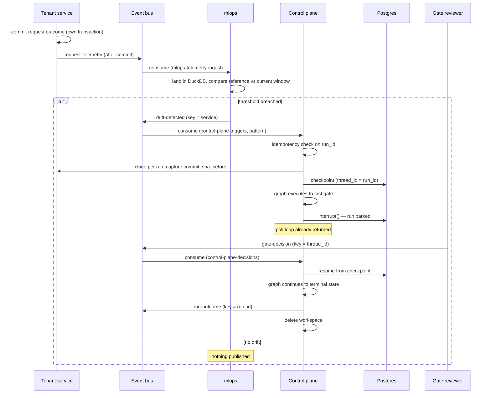

# Agentic SDLC Platform — System Design

**Status:** Current · **Last verified:** 2026-07-28 · **Owner:** Platform engineering

This is the authoritative design document for the `agentic-sdlc-*` platform. It describes the
system as built and verified, not as proposed. Content is stated as fact only where it has been
exercised against running infrastructure; anything not yet built is marked **Planned**.

Decisions and the reasoning behind them live in [`adr/`](adr/). This document describes *what the
system is*; the ADRs record *why it is that way*, and are linked from the relevant sections.

---

## 1. Purpose and scope

The platform detects operational regressions in a running service, and responds by orchestrating a
governed, human-gated software change against that service's repository.

It is built as four independently deployable repositories communicating exclusively over Kafka. No
repository shares a database, a filesystem, or a compose network with any other, and each can be
cloned and started with no sibling checkout present.

### In scope

- Operational-metrics drift detection over request telemetry
- Orchestration of a multi-step change workflow (clarify → analyse → design → plan → code → test →
  document → release) with human approval gates
- Durable suspension and resumption of a run across process restarts
- Audit of every node execution, gate decision, and run outcome

### Explicitly out of scope

- Model-based drift. Phase 1 is operational metrics only; no ML model exists in the system. See
  [§12](#12-roadmap).
- Multi-tenancy. The event contract carries a `tenant` field for forward compatibility, but the
  platform operates a single implicit tenant today.
- Automated merge to a tenant's default branch. A run commits within its own ephemeral clone; it
  does not push.

### Tenancy model

Three repositories form the **platform** and are strictly domain-agnostic — they contain no
knowledge of what any service they operate on actually does. The fourth is a **tenant**: an
ordinary application that plugs into the platform and is in no way privileged.

This separation is a hard constraint, not a convention, and is enforced by a build step rather than
by review — see [ADR 0001](adr/0001-keep-the-control-plane-domain-agnostic.md) and
[§11.3](#113-domain-agnosticism). Throughout this document a tenant service may be *named* as a
concrete example; its internals are never described, and nothing in the platform depends on them.

---

## 2. System context


Every solid arrow is a Kafka topic; the only non-Kafka interaction the platform has with a tenant
is the dashed one, a read-only clone. Both control-plane inbound flows are shown as one edge here
for legibility — they are separate topics on separate consumer groups, detailed in
[§5.1](#51-topics) and [§6.1](#61-process-structure).

| Actor | Role |
|---|---|
| Tenant service | Emits request telemetry. Its repository is the target of a run. Otherwise uninvolved. |
| Gate reviewer | A human who approves or rejects at a gate, by publishing a decision event. |
| Platform | Everything inside the boundary. Owns detection, orchestration, and audit. |

---

## 3. Design principles

These are binding constraints. Each is implemented as stated, and the verification for each is
given in [§11](#11-verification).

| # | Principle | Consequence |
|---|---|---|
| P1 | **Kafka is the only coupling.** | No shared database, filesystem, or compose network between repositories. Integration points are topics and one shared contract package. |
| P2 | **Database per service.** | The control plane owns its checkpoint store. No other component may read it. |
| P3 | **The platform is domain-agnostic.** | No platform repository may encode a tenant's concepts. Enforced by CI. |
| P4 | **Human gates are real suspensions.** | A gate is a durable interrupt backed by Postgres, not a synchronous prompt. A run survives the process that started it. |
| P5 | **A poll loop never waits on a human.** | Consumers validate and hand off. Execution happens elsewhere. |
| P6 | **A run is never lost.** | Every run terminates in exactly one reported state, including on crash or internal error. |
| P7 | **Workspaces are ephemeral and isolated.** | One clone per run, deleted on termination. Concurrent runs cannot observe each other. |
| P8 | **New producers require no code change.** | Consumers subscribe by pattern; topics auto-create. |
| P9 | **Credentials never enter a URL, a log, or an image.** | Tokens are supplied via file-mounted secrets and credential helpers, and verified absent from build artefacts. |

---

## 4. Component architecture

| Repository | Role | Stack | Package |
|---|---|---|---|
| `agentic-sdlc-control-plane` | Orchestration, human gates, audit | Python 3.12, LangGraph 1.2.9, PostgreSQL 16 | `agentic_control_plane` |
| `agentic-sdlc-mlops` | Drift detection | Python 3.12, DuckDB, Evidently, MLflow | `agentic_mlops` |
| `agentic-sdlc-eventbus` | Message broker + shared contract | Apache Kafka 4.1.2 (KRaft) | `agentic_events` |
| Tenant service | Application under governance | Any | — |

`agentic_events` is the only package installed *into* other repositories. It contains the envelope
model and validation, and deliberately no Kafka client code, so adopting the contract does not
impose a transport dependency.

### 4.1 Network topology

A listener's *advertised* address is what a client is told to reconnect to for real traffic, so it
must differ by caller position. Three listeners exist for that reason:

| Caller position | Bootstrap address | Listener |
|---|---|---|
| Container on the broker's own network | `broker:19092` | `PLAINTEXT` |
| Host machine (CLI tooling) | `localhost:9092` | `PLAINTEXT_HOST` |
| Container in a *different* compose project | `host.docker.internal:9093` | `DOCKER_INTERNAL` |

The third listener exists because reusing the second appeared to work and silently did not: it
advertises `localhost`, which inside a different container resolves to that container. Bootstrap
succeeded and every subsequent send failed. Verification for this path is therefore explicitly
container-to-container, in both directions — see [§11.2](#112-cross-repository-verification).

---

## 5. Event contract

One envelope for every message on every topic. The envelope shape is a stable contract; per-event
variation lives inside `metrics` and `payload`, which are deliberately open.

```jsonc
{
  "schema_version": "1.0",          // envelope version; bumps only on a breaking envelope change
  "event_id": "<uuid>",             // unique per message
  "correlation_id": "<string>",     // == run_id == LangGraph thread_id once a run exists
  "tenant": "default",              // forward compatibility; single tenant today
  "service": "<producer service>",  // drives the topic convention
  "event_type": "<string>",         // drift-detected | gate-decision | run-outcome | ...
  "timestamp": "<RFC 3339>",
  "producer": { "service": "<string>", "instance_id": "<hostname or container id>" },
  "git_target": { "repo_url": "<uri>", "branch": "<string>", "commit_sha": "<sha|null>" },
  "scenario_type": "greenfield | brownfield | ambiguous",
  "metrics": { },                   // event-type specific, open
  "payload": { }                    // event-type specific, open
}
```

Validation is enforced by the shared `agentic_events` Pydantic model with `extra="forbid"`, so an
unknown top-level field is rejected rather than silently ignored.

### 5.1 Topics

Convention: `{service}.{event-type}.v{n}`. No tenant segment — the system is single-tenant today,
and adding a segment later is a topic rename, not a contract change.

| Topic | Producer | Consumer group | Partition key | Ordering guarantee bought |
|---|---|---|---|---|
| `<tenant>.request-telemetry.v1` | Tenant service | `mlops-telemetry-ingest` | resource identifier | Per-resource history stays on one partition |
| `mlops.drift-detected.v1` | `agentic-sdlc-mlops` | `control-plane-triggers` | service name | A service's drift events stay mutually ordered |
| `control-plane.gate-decision.v1` | Gate reviewer | `control-plane-decisions` | `thread_id` (== `run_id`) | **Correctness-critical.** A later decision can never be processed before an earlier one for the same parked run. |
| `control-plane.run-outcome.v1` | `agentic-sdlc-control-plane` | *(open)* | `run_id` | A run's outcomes stay ordered |
| `control-plane.audit.v1` | `agentic-sdlc-control-plane` | *(open)* | `run_id` | A run's audit records stay ordered. The independent copy of the audit trail — see [§10.3](#103-observability-and-audit). |
| `{service}.dlq.v1` | Any | *(manual)* | source topic | — |

### 5.2 Compatibility policy

Additive-only. New fields are added as optional properties inside `payload` or `metrics`, both of
which are already open. `schema_version` bumps **only** on a breaking change to the envelope itself
— removing or renaming a required top-level field, or changing a field's type. Flexibility is
deliberately located inside the open objects rather than at the envelope level, so a consumer can
rely on the envelope's shape absolutely.

### 5.3 A note on field naming across boundaries

`decided_by` means different things on the wire (an identity) and in graph state (provenance:
whether a human or a replayed fixture resolved a gate). The translation happens once, at the
consumer boundary. This is called out here because two schemas sharing a field name with different
meanings is a standing hazard — see
[ADR 0002](adr/0002-map-decision-identity-to-state-provenance.md).

---

## 6. Control plane internals

### 6.1 Process structure


Two independent read paths and one worker. The separation is the load-bearing design decision:

- **Neither consumer executes anything.** They validate a message and enqueue work. A gate can park
  a run for as long as a human takes to answer; a poll loop blocked across that would exceed
  `max.poll.interval.ms`, trigger a rebalance, and take every other in-flight run on the partition
  with it.
- **Resumption is a separate read path**, not a branch inside the trigger loop, so resuming a run
  is structurally never something the trigger loop does.
- **The worker is single-threaded** and owns the checkpointer exclusively, so the thread-safety of
  a checkpointer connection never becomes a question that has to be answered by testing. Runs
  execute serially, which is correct at this platform's volume.

Offsets commit on enqueue rather than on completion, because committing on completion would put a
clone and a full graph run back inside the poll loop —
[ADR 0005](adr/0005-single-threaded-worker-and-when-offsets-commit.md).

Work is therefore written to a `work_inbox` table in this service's own Postgres *before* it
reaches the in-memory queue, and deleted once the worker has finished with it. Anything still there
at startup is work a previous process accepted and did not finish, and is put back on the queue
before the poll loops start. Failing to record is treated as refusal, so nothing is ever queued
that could not be written down — [ADR 0010](adr/0010-durable-work-hand-off.md).

The queue is bounded, so it can fill. When it does the message is left uncommitted, its partition
is rewound to it and paused, and it is redelivered once the worker drains — backpressure rather
than loss, see [ADR 0007](adr/0007-a-full-work-queue-is-backpressure-not-loss.md).

### 6.2 Workflow graph


Nine nodes plus two helpers (`sync`, a parallel join barrier; `rollback`). Routing is conditional:
greenfield skips impact analysis; `test_executor` and `documentation` fan out in parallel and
rejoin; a bounded retry → fallback → rollback → safe-stop chain limits how long a failing run
retries before terminating cleanly.

### 6.3 Human gates

Five gate types exist. Which fire depends on `scenario_type` — a point where the original design
assumption ("all five always block") did not match the implementation:

| Gate | Fires on | Node |
|---|---|---|
| `clarification_approval` | greenfield | `requirement_clarifier` |
| `codebase_impact_review` | brownfield | `codebase_reasoner` |
| `plan_approval` | greenfield | `decomposer_planner` |
| `replanning_approval` | ambiguous, when a conflict is detected | `replanner` |
| `merge_release_approval` | always | `release_gate` |

Every gate that fires blocks. A gate calls LangGraph `interrupt()`; the run's entire state is
written to PostgreSQL and the process returns to polling. Resumption is driven by a decision
message correlated on `thread_id == run_id`, and may be performed by a different process entirely.

`release_gate` additionally applies defence in depth: where guardrail violations exist (unsafe
calls, DDL statements, secret-shaped strings) and the reviewer did not explicitly set
`override_guardrails`, the merge is treated as blocked regardless of the raw approve/reject status
received.

### 6.4 Terminal states

Every run ends in exactly one of these, and each publishes a `run-outcome` event. There is no path
that ends a run without one — see
[ADR 0003](adr/0003-a-failed-run-must-be-reported-never-lost.md).

| State | Meaning |
|---|---|
| `completed` | Release gate approved; changes committed in the run's workspace |
| `failed` | Rejected at a gate, or an unhandled error during graph execution |
| `safe_stop` | Rollback was required and could not be completed safely, or code generation was unavailable |
| `clone_failed` | The target repository or branch could not be acquired |
| `stale` | Parked beyond the TTL with no decision received |

### 6.5 Workspace lifecycle

One clone per run at `{WORKSPACES_ROOT}/{run_id}`, shallow, single-branch. The commit SHA at clone
time is captured as `commit_sha_before` — the revision a rollback reverts to, and the value
reported on the outcome event.

On startup the service reconciles orphaned workspaces, asking of each *"is this run still
resumable?"* rather than *"is it finished?"* — so a workspace whose run the checkpointer has never
heard of (a crash between clone and first checkpoint) falls on the delete side by default rather
than through a case someone has to remember to add. A run that is parked is never touched, and a
workspace the checkpointer cannot be queried about is kept.

### 6.6 Delivering an approved change

A completed run's commit is delivered before the workspace is reclaimed — that window is the only
point at which it still exists on disk. `PUBLISH_MODE` selects what happens, and defaults to
`none`, because pushing requires a write-scoped credential this service otherwise does not need
([ADR 0012](adr/0012-an-approved-change-must-outlive-the-run-that-made-it.md)).

| Mode | Behaviour |
|---|---|
| `none` *(default)* | Commit and report. Governance without delivery; the PAT stays read-only |
| `branch` | Push `agentic-patch/{run_id}`. Any git host |
| `pull_request` | Push, then open a request against **the branch the run cloned**. GitHub only; degrades to `branch` with a stated reason elsewhere |

The push names `HEAD:refs/heads/agentic-patch/{run_id}` explicitly, so nothing in this path can
write to the tenant's integration branch. The outcome event reports `commit_sha_after`, `published`,
the branch, the pull-request URL where there is one, and `publish_error` where delivery failed.

A delivery failure does not fail the run: the change was generated, tested and approved regardless.
It is reported on the outcome event instead, because a failed push means the change was discarded
and that must be visible without being misreported as a rejected release.

---

## 7. Runtime flow



The tenant's transactional boundary sits entirely within the tenant. Telemetry is published only
*after* its local commit, so no downstream component can observe telemetry for a request whose
outcome was not durably recorded. No other component has network access to that database, by
construction and by policy.

---

## 8. Reliability and failure modes

| Failure | Handling |
|---|---|
| **Duplicate delivery of a drift event** | `correlation_id` is derived deterministically by the producer from the drift condition, so a redelivery carries a `run_id` already present in the checkpointer. The second delivery is acknowledged as a no-op; no second run starts. |
| **Long-running graph vs. `max.poll.interval.ms`** | Execution is fully decoupled from the poll loop. Run duration cannot cause a rebalance. |
| **Rebalance while a run is parked** | Parked state lives in PostgreSQL, not consumer memory. Any group member can resume the run once the matching decision arrives. |
| **Node raises during execution** | Reported as `failed` with the real exception text, workspace cleaned up. Previously such a run was left neither resumable nor terminal and vanished — [ADR 0003](adr/0003-a-failed-run-must-be-reported-never-lost.md). |
| **Poison message** | Forwarded to the DLQ with the raw payload and the failure reason; offset advances past it so one bad message never blocks a partition. Validation failures go straight to the DLQ rather than through a retry, because a payload that violates the contract fails identically every time. |
| **Transient Kafka client error** | Poll failures are retried with a bounded tolerance. Ten consecutive failures re-raise, so a permanently broken consumer fails loudly rather than looping quietly — [ADR 0004](adr/0004-the-poll-loop-tolerates-transient-client-errors.md). |
| **Decision never arrives** | A sweep expires runs parked past the TTL (default 24h) to `stale`, emitting an outcome and reclaiming the workspace. |
| **Clone failure** | Terminal `clone_failed` with the underlying git error; no partial workspace left behind. |
| **Crash between clone and checkpoint** | Startup reconciliation removes the orphaned workspace. |
| **Broker unavailable at publish** | Producer construction is bounded on a background thread; publish failures are logged and counted, never raised. A broker outage cannot turn a completed run into a failed one. |
| **Work queue full** | Backpressure, not loss. The message is left uncommitted, its partition rewound to it and paused, and it is redelivered once the worker drains. Previously the message was dropped and the offset committed past it, so the trigger was lost with no outcome event — [ADR 0007](adr/0007-a-full-work-queue-is-backpressure-not-loss.md). |
| **Process dies with work queued** | Recovered. Work is written to a `work_inbox` table before it reaches the in-memory queue and deleted once finished, so anything unfinished is restored at the next startup — [ADR 0010](adr/0010-durable-work-hand-off.md). Verified by killing the container mid-drain: 12 of 14 items survived and were restored. The trade is a duplicate window rather than a loss window; a restored item that Kafka also redelivers carries the same `run_id` and is a no-op. |

### 8.1 Durability posture — what is a system of record and what is not

Reviewers reasonably ask which stores are single points of failure. The answer differs per store,
and the distinction that matters is whether a store's contents can be rebuilt from somewhere else.

| Store | Role | If its disk is lost |
|---|---|---|
| **mlops DuckDB** | Derived cache | **Rebuildable.** It holds telemetry ingested from `*.request-telemetry.v*`. Replay the topic within its retention and the windows are reconstructed. This is what the event bus is *for*, and it is why a managed warehouse is not on the roadmap: the store is not the system of record, and treating it as one would be paying for a durability guarantee that Kafka already provides. |
| **control-plane Postgres** | System of record for in-flight runs | **Lossy.** It holds LangGraph checkpoints and the `work_inbox`. Losing it strands parked runs: they are neither resumable nor terminal, and no outcome is published. Nothing else holds that state. Backup is a deployment concern this repository does not prescribe. |
| **Audit JSONL volume** | One of two audit copies | **Tolerable alone.** The Kafka `control-plane.audit.v1` copy survives it — that is the point of two sinks that fail differently ([ADR 0008](adr/0008-the-audit-trail-must-be-checkable-not-merely-appended.md)). |
| **Kafka log dir** | The independent audit copy, and every topic | **The real limit — see below.** |

**The broker is the actual single point of failure, not DuckDB.** It runs single-node in KRaft
mode with `KAFKA_OFFSETS_TOPIC_REPLICATION_FACTOR: 1`; on one node no topic can be replicated
further. ADR 0008's tamper-evidence argument rests on the audit topic being *an independent copy
out of reach of whoever can write the file volume* — and that copy currently has no redundancy of
its own. Losing the broker's disk loses it, and with it the comparison that detects truncation of
the JSONL tail.

That is a deliberate development-scale trade, not an oversight: a single-node broker fits the 8 GiB
allocation this platform is developed in, and the alternative is three brokers for a workload whose
volume is drift events. But it bounds the integrity claim, and the claim should be read with the
bound attached: **tampering with the file is detectable for as long as the broker's copy exists.**
A production deployment raises the replication factor before it relies on that property, and that
is the change that matters — not the choice of analytics store.

---

## 9. Security

| Concern | Control |
|---|---|
| Repository access | Fine-grained, **read-only** PAT by default. Scope must cover the repositories a run will clone. Enabling `PUBLISH_MODE` (§6.6) requires a **write-scoped** token, which widens a compromise from *read the tenant's code* to *write branches in the tenant's repository* — the reason delivery is opt-in rather than default, see ADR 0012. Even then, the push names a `agentic-patch/*` ref explicitly and cannot write the tenant's integration branch. |
| Token in transit to git | Supplied by a credential helper invoked at request time. Never in the remote URL, never in `git remote -v`, never in `.git/config`, never in the process argument list. |
| Token at rest | Mounted as a Docker file-based secret, not a compose environment value — an environment value is readable via `docker inspect`. |
| Token in build artefacts | Injected as a BuildKit secret and unset within the same layer. **Verified, not assumed**: CI asserts `/root/.gitconfig` is 0 bytes in the built image. |
| Token in logs | Redacted from text bound for a log line, as defence in depth. |
| Database credentials | File-based secrets via the `_FILE` convention. Credential components are percent-encoded into the connection URI, so a password containing `@` or `/` fails cleanly rather than parsing into the wrong host. |
| Generated code | Guardrail scanning for unsafe calls, DDL statements, and secret-shaped strings, surfaced at the release gate and blocking by default. |
| Repository visibility | All four platform repositories are public. Nothing in this design depends on their privacy: every credential is a mounted file-based secret, no CI job requires one, and no CI step publishes to a registry. The runtime PAT is scoped to the *tenant* repositories a run clones, which is independent of this platform's own visibility. |

---

## 10. Deployment and operations

Each repository ships its own `docker-compose.yml` and is independently startable. Order matters
only in that the event bus should exist before producers.

### 10.1 Resource footprint — measured

All containers running simultaneously, re-measured with `docker stats` on 2026-07-27 after
`mlflow` was re-sized (see mlops ADR 0004):

| Container | Repository | Measured | Limit | Utilisation |
|---|---|---|---|---|
| `mlflow` | mlops | 317.9 MiB | 1 GiB | 31.0% |
| `mlops-consumer` | mlops | 302.3 MiB | 768 MiB | 39.4% |
| `kafka` | eventbus | 242.8 MiB | 2 GiB | 11.9% |
| `control-plane-consumer` | control-plane | 71.9 MiB | 1 GiB | 7.0% |
| tenant API | tenant | 69.8 MiB | 512 MiB | 13.6% |
| `control-plane-postgres` | control-plane | 24.5 MiB | 512 MiB | 4.8% |
| tenant `postgres` | tenant | 23.5 MiB | 512 MiB | 4.6% |
| **Total** | | **1.03 GiB** | 6.25 GiB | **16.4%** |

`mem_limit` is a cap, not a reservation, and limits are deliberately generous so a spike degrades
rather than triggering an OOM kill. Every service now sits below 40% of its ceiling, and the
ceilings themselves sum to 6.25 GiB — within the 8 GiB development allocation rather than above it.

The previous measurement (2026-07-26) totalled 2.86 GiB against 8.25 GiB of ceilings, of which
`mlflow` alone was 2.087 GiB — 73% of the platform, on a service nothing wrote to. That was a
correctly measured number attached to a feature this deployment never used: MLflow 3.x starts an
async job subsystem whenever its backend store is a database. Disabling it took the service to
312 MiB and the platform to a third of its former footprint.

### 10.2 Configuration

Control plane, by environment variable:

| Variable | Default | Purpose |
|---|---|---|
| `KAFKA_BOOTSTRAP_SERVERS` | *(required)* | Event bus address; position-dependent, see [§4.1](#41-network-topology) |
| `POSTGRES_HOST` / `PORT` / `DB` / `USER` | `postgres` / `5432` / `control_plane` / `control_plane` | Checkpoint store |
| `POSTGRES_PASSWORD_FILE` | — | Path to the mounted password secret |
| `GIT_PAT_FILE` | — | Path to the mounted PAT |
| `WORKSPACES_ROOT` | `/workspaces` | Per-run clone root |
| `FIXTURES_DIR` | `/fixtures` | Replay fixtures; empty unless mounted |
| `ORCHESTRATOR_MODE` | `replay` | `live` requires a CLI the image does not install |
| `PARKED_RUN_TTL_HOURS` | `24` | Parked-run expiry |
| `REPLANNING_CONFLICT_MARKERS` | *(empty)* | Module names counting as an existing-functionality conflict |
| `AUDIT_LOG_PATH` | `/var/audit/runs.jsonl` | Hash-chained audit trail. Outside the workspaces root deliberately — see ADR 0009. |
| `PUBLISH_MODE` | `none` | `none` / `branch` / `pull_request`. Anything but `none` needs a **write-scoped** PAT — see [§6.6](#66-delivering-an-approved-change) and ADR 0012. |

### 10.3 Observability and audit

Two deliberately separate streams:

- **Operational logging** — levelled application logs for diagnosis: what a subprocess returned,
  whether a git operation succeeded, why a checkpointer was selected.
- **Audit trail** — a stream of `AuditEvent` records, one per node execution, gate decision, retry,
  fallback, rollback, safe-stop, and guardrail violation. Each carries a timestamp, node, event
  type, detail, decision, and latency. This is the record of *what the system decided and on whose
  authority*, including the reviewer identity behind each gate.

Reliability metrics — success rate, retry frequency, rollback frequency, MTTR, end-to-end latency —
are derived from the audit trail rather than collected separately, so there is one source of truth.

#### Audit integrity

The audit trail is written to two sinks that fail differently, and is checkable rather than merely
appended — see [ADR 0008](adr/0008-the-audit-trail-must-be-checkable-not-merely-appended.md).

| Sink | Property | Weakness it does not cover |
|---|---|---|
| Hash-chained JSONL file | Each record carries the SHA-256 of its predecessor. `verify_chain` reports the first record that does not hold, by line and reason. | Writable by whoever holds the volume. Truncation of the tail leaves a shorter chain that still verifies. |
| `control-plane.audit.v1` | An independent copy, out of reach of that writer. Comparison against it is what catches truncation. | Retention is the broker's default until explicit topic provisioning lands ([§12](#12-roadmap)). |

**A chain says nothing about records that were never written.** Both sinks record events per run,
and the cursor tracking what has already been flushed is keyed by `run_id` and retired with the run
— [ADR 0011](adr/0011-the-audit-cursor-belongs-to-the-run-not-the-process.md). When that cursor was
process-scoped instead, every run after the first went unrecorded while `verify_chain` still
reported `ok=True`, because the chain it checked was intact; it was simply short. The check that
detects this class is counting records per `correlation_id` on `control-plane.audit.v1` against
runs actually served — the topic is what makes that comparison possible, which is a second reason
for the two-sink design beyond tamper-detection.

Neither is WORM storage. Both sinks sit inside the trust boundary the platform runs in, so the
claim is *tampering is detectable*, not *tampering is impossible*. Regulatory-grade retention means
shipping these records somewhere the platform cannot delete its own history — object-lock storage
or a SIEM — which is not built.

**The chain assumes a single writer, and that is what bounds this service to one instance.**
`TelemetrySink` holds the chain head — the next sequence number and the previous record's digest —
as process state, and appends without a file lock. That is sound for the process structure in
[§6.1](#61-process-structure), where one single-threaded worker owns the trail, and it is the
constraint to check first before running a second instance:

| Deployment | What happens to the trail |
|---|---|
| One instance (what is built) | One writer, one chain, `verify_chain` meaningful end to end. |
| Two instances, shared audit volume | Both hold their own chain head and interleave appends. Sequence numbers collide and `prev_hash` stops matching, so the trail fails verification for a reason that is not tampering — the worst outcome available, because it makes a real alert indistinguishable from noise. |
| Two instances, separate volumes | Two internally valid chains with no ordering between them. Neither is the audit trail; the union of them is, and nothing reconstructs it. |

Scaling out is otherwise unobstructed — the trigger consumer is already in a Kafka consumer group,
so a second instance would be handed a partition and start work without any other change. The audit
trail is the thing that would break quietly, so it is stated here rather than discovered.

Two ways forward, neither built. Segment the chain per instance — carry the instance id in each
record and verify per segment, which keeps the file sink and gives up a single global order. Or
treat `control-plane.audit.v1` as the ordering authority and demote the file to a local cache,
which is the direction the two-sink design already leans, since the topic is the copy the writer
cannot reach. The choice depends on whether a total order across instances is worth a broker
dependency in the verification path; at one instance it is not, which is why neither exists yet.

### 10.4 Code generation availability

Neither generation mode is available in the shipped image, by design:

- **Replay** requires fixtures, which are recordings of work on one specific service. A
  domain-agnostic platform cannot ship them; `FIXTURES_DIR` is a mount point.
- **Live** requires an agent CLI and an authenticated session, which the image does not provide.

Without either, a run reaches the coder node and safe-stops with a stated reason — a defined
terminal state with outcome telemetry, not a crash. This is a real capability limit, accepted
because the alternative is embedding one tenant's source in the platform meant to serve all of
them. See [ADR 0001](adr/0001-keep-the-control-plane-domain-agnostic.md).

---

## 11. Verification

### 11.1 Automated tests

| Repository | Tests | Coverage | Notes |
|---|---|---|---|
| `agentic-sdlc-control-plane` | 226 | 91% | 0 skipped in CI; gate durability runs against a real PostgreSQL service container |
| `url-shortener-api` (tenant) | 35 | 92% | |
| `agentic-sdlc-mlops` | 29 | 79% | |
| `agentic-sdlc-eventbus` | 8 | 100% | Contract package; enforced at 100% in CI |

Remaining uncovered lines across the platform are concentrated in code requiring live
infrastructure — real Kafka client construction, entrypoint wiring, agent CLI invocation — and are
covered by functional verification instead of by mocks that would only assert their own
assumptions.

All four repositories have an **observed-green CI run**. A workflow file is not evidence; a passing
run is. This distinction is recorded because CI was previously reported as delivered on two
repositories where it had never once succeeded.

### 11.2 Cross-repository verification

A repository's own tests passing does not prove an integration point works. Each is exercised from
the position the calling component actually occupies:

| Check | Result |
|---|---|
| Pattern subscription discovers a topic created after consumer startup | Pass — run began ~31 s after publish, matching the tuned 30 s `metadata.max.age.ms` |
| Container **consumes** through the cross-container listener | Pass |
| Container **publishes** through the cross-container listener | Pass — message consumed back off the topic, `producer.instance_id` matching the container hostname |
| Private-repository HTTPS clone via the mounted PAT | Pass — against a repository that was private when this was run; the platform's own repositories are public now, but clone-per-run still authenticates the same way against private tenant repositories |
| PAT lacking access to the target | Pass — degrades to `clone_failed` with the real error, no crash |
| Gate parks without blocking the poll loop | Pass |
| Decision from Kafka resumes the parked run | Pass |
| Sandboxed test execution inside the container | Pass |
| Full run to `completed` in-container | Pass — committed in the workspace, outcome published, workspace removed |
| **Parked run resumed by a different process after the original was killed** | Pass — the durability property P4 depends on, demonstrated rather than argued |
| Startup reconciliation removes orphaned workspaces | Pass |
| **Work accepted from Kafka survives the process that accepted it** | Pass — 14 events published, container `SIGKILL`ed mid-drain, 12 unfinished items found in `work_inbox` and restored on the next start, with Kafka at zero lag throughout ([ADR 0010](adr/0010-durable-work-hand-off.md)) |
| Startup reconciliation **leaves the audit trail alone** | Pass — previously deleted it on every restart ([ADR 0009](adr/0009-the-audit-trail-does-not-live-in-the-workspaces-root.md)) |
| Audit chain written by the container verifies end to end | Pass — `verify_chain` ok over the real file |
| Editing one record in the real audit file is detected | Pass — reported at the exact line, *"record contents do not match its own digest"* |
| Audit records reach `control-plane.audit.v1` | Pass — consumed back off the topic, carrying the run's `correlation_id` and clone commit |
| Built image carries no credential | Pass — `/root/.gitconfig` is 0 bytes |

### 11.3 Domain agnosticism

CI fails the build if tenant vocabulary appears anywhere in the control plane's package or tests.
This is enforcement, not review: the constraint was violated by the code this component was ported
from, in four separate places, none of which looked like coupling while only one target service
existed.

---

## 12. Roadmap

| Item | Status |
|---|---|
| Model-based drift (feature and prediction drift against a real model) | **Planned** — Phase 2. Requires a tenant with a model; the current drift path is operational metrics only. |
| Outcome feedback loop (correlating a run's outcome back to the drift that triggered it) | **Planned** — the contract supports it; no consumer implemented. |
| Durable work hand-off | **Built** — [ADR 0010](adr/0010-durable-work-hand-off.md). Work is recorded in Postgres before it is queued and restored at startup, closing the loss window in [ADR 0005](adr/0005-single-threaded-worker-and-when-offsets-commit.md). |
| Parallel run execution | **Planned** — a worker pool, each with its own checkpointer. Bounded change; not needed at current volume. |
| Audit chain across more than one instance | **Planned** — the chain head is process state written without a lock, so a second instance either corrupts a shared trail or splits it in two ([§10.3](#audit-integrity)). Nothing else blocks scaling out, which is why it is written down: the consumer group would hand a second instance work immediately. |
| Explicit topic provisioning | **Planned** — auto-creation is unacceptable at real-cluster scale: a producer typo silently creates a junk topic, every topic inherits one-size-fits-all defaults, and any authenticated producer can create unbounded topics. Replace with CI-managed or Terraform-managed manifests carrying deliberate partition, replication, retention, and ACL settings. |
| Multi-tenancy | **Planned** — the envelope carries `tenant`; nothing consumes it yet. |

---

## 13. Decision log

| ADR | Subject |
|---|---|
| [0001](adr/0001-keep-the-control-plane-domain-agnostic.md) | Keeping the control plane domain-agnostic |
| [0002](adr/0002-map-decision-identity-to-state-provenance.md) | Mapping decision identity to state provenance |
| [0003](adr/0003-a-failed-run-must-be-reported-never-lost.md) | A failed run must be reported, never lost |
| [0004](adr/0004-the-poll-loop-tolerates-transient-client-errors.md) | Poll-loop tolerance of transient client errors |
| [0005](adr/0005-single-threaded-worker-and-when-offsets-commit.md) | Single-threaded worker; offset commit timing |
| [0006](adr/0006-configure-the-committer-identity-on-a-cloned-workspace.md) | Committer identity on a cloned workspace |
| [0007](adr/0007-a-full-work-queue-is-backpressure-not-loss.md) | A full work queue is backpressure, not loss |
| [0008](adr/0008-the-audit-trail-must-be-checkable-not-merely-appended.md) | The audit trail must be checkable, not merely appended |
| [0009](adr/0009-the-audit-trail-does-not-live-in-the-workspaces-root.md) | The audit trail does not live in the workspaces root |
| [0010](adr/0010-durable-work-hand-off.md) | Durable work hand-off |
| [0011](adr/0011-the-audit-cursor-belongs-to-the-run-not-the-process.md) | The audit cursor belongs to the run, not the process |
| [0012](adr/0012-an-approved-change-must-outlive-the-run-that-made-it.md) | An approved change must outlive the run that made it |
| [0013](adr/0013-liveness-is-the-workers-signal-not-the-process.md) | Liveness is the worker's signal, not the process's |
